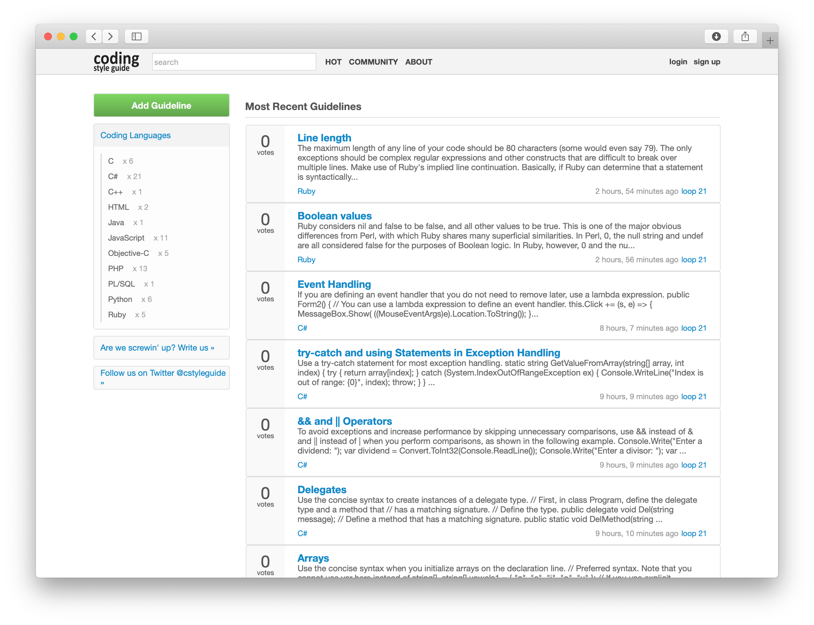

# Coding Style Guide - Discontinued

## About

Coding Style Guide was a community-driven reference site. To make your code universally readable it collects and provides programming guidelines for lots of programming languages. I try hard to make it simple to use, so you can easily adapt your code to the guideline that is most convenient for you.

Note: This project is no longer available. A snapshot of codingstyleguide.com can be found [here](https://web.archive.org/web/20140319013005/http://codingstyleguide.com:80/)

